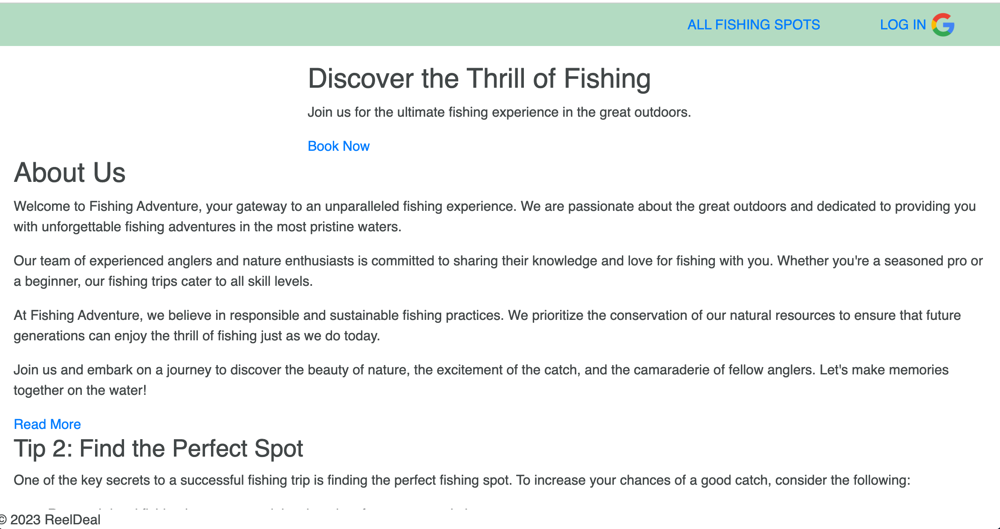
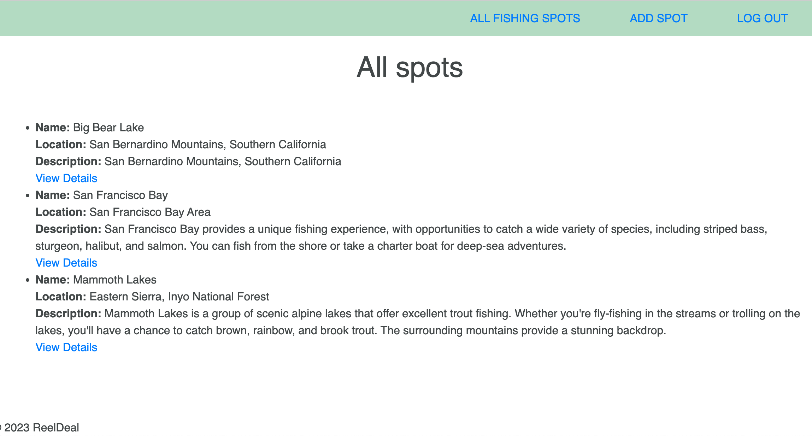

# Fishing Spots Project

Welcome to the Fishing Spots project! This is a web application that allows users to discover and share their favorite fishing spots. Whether you're an angler looking for new places to fish or you want to share your secret fishing holes with others, this app is for you.

## Table of Contents

- [Features](#features)
- [Getting Started](#getting-started)
- [Technologies and Tools Used](#Technologies-and-Tools-Used)
- [ScreenShots](#installation)
- [Web App Features](#Web-App-Features)
- [Planned future enhancements](#Planned-future-enhancements)

## Features

- View a list of fishing spots with details.
- Add new fishing spots, including their names, locations, and fish species.
- Explore fishing spot details, including descriptions and user reviews.
- Add, edit, and delete your own reviews for fishing spots.
- User authentication and authorization.
- And more!

## Getting Started

https://reel-deal-f82984731cf8.herokuapp.com/

## Technologies and Tools Used

1. **Frontend Technologies:**

  
  

2. **Backend Technologies:**
  
  

3. **Database Technologies:**
  
  
4. **User Authentication and Authorization:**
   - [ ] Passport.js

5. **Package Managers:**
   - [ ] npm (Node Package Manager)

6. **Version Control:**
  
  

7. **Deployment and Hosting:**
   

## ScreenShots

## Web App Features

- **Browse Fishing Spots:** Discover a wide range of fishing spots with detailed information such as name, location, and available fish species.

- **Add New Fishing Spots:** Users can contribute to the community by adding new fishing spots they've explored. Include fields for name, location, and available fish species.

- **Spot Details:** View detailed information about each fishing spot, including its name, location, description, and available fish species.

- **User Reviews:** Users can read and leave reviews for fishing spots, sharing their experiences and tips with the community.

- **User Authentication:** Implement user registration and login functionality to personalize the user experience and enable user-generated content.

- **Edit and Delete Spots:** Users with appropriate permissions can edit or remove fishing spots they've added.

## Planned future enhancements

- **Interactive Maps:** If applicable, incorporate interactive maps to help users locate fishing spots easily.

- **Search and Filters:** Allow users to search for fishing spots based on location, fish species, and other criteria.

- **Responsive Design:** Ensure that your web application is responsive and accessible on various devices, including desktop and mobile.

- **User-Friendly UI:** Create an intuitive and visually appealing user interface for a seamless user experience.
